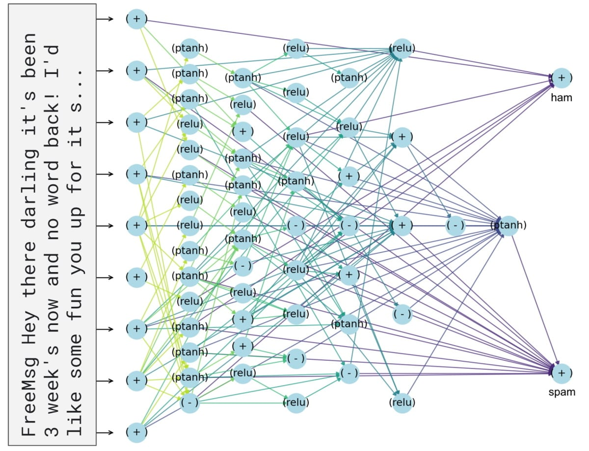

# Weight Agnostic Neural Networks (Fork for NLP)
Fork of prettyNeatWann in Adam Gaier and David Ha's [WANN](https://github.com/google/brain-tokyo-workshop/tree/master/WANNRelease) (weight-agnostic neural networks) repository, with some additions that enable speech recognition and two simple text classification tasks:

- Spam Classification (Data: [Almeida and Hidalgo](http://www.dt.fee.unicamp.br/~tiago/smsspamcollection/).) *This is the only task included in our [paper](https://drive.google.com/file/d/10o0PHSY7j3en9O24zZRwE7jBycIrJXMV/view?usp=sharing).*
- Binary Sentiment Analysis (Data: [Stanford](https://ai.stanford.edu/~amaas/data/sentiment/).)



Three levels of sentence embeddings are offered:

- ASCII: extended-ASCII code of first character of each token.
- BoW: token counts using training data as corpus. Varying vocabulary size leads to changes in the dimensionality of incoming vectors, thus changing quantity & quality of prior information. *This is the only embedding style included in the paper.*
- BiLSTM with mean/max pooling: using [Conneau et al.](https://arxiv.org/abs/1705.02364)'s pre-trained model on GloVe. Varing vocabulary size leads to changes in quality of prior information, since incoming vectors are always of size 4096. *We lack sufficient computational power to perform architectural search on such large vectors, but the code is ready.*


## Setting things up
Python 3.7.7. If `python` doesn't work, try `python3`
1. Fork this repostiory

`git clone https://github.com/duynguyen158/wann-nlp.git`

2. Install OpenMPI, OpenAI Gym, scikit-learn, pandas, and NumPy

`pip install mpi4py` (3.0.3)

`pip install gym` (0.17.1)

`pip install scikit-learn` (0.22.1) 

`pip install numpy` (1.18.1)

3. Install nltk and download nltk tokenizer

`pip install nltk` (3.4.5)

`python -c 'import nltk; nltk.download("punkt")'`

4. (If you'd like to work with with BiLSTM embeddings) Download InferSent, GloVe and pre-trained GloVe model
* InferSent
```
cd domain
git clone https://github.com/facebookresearch/InferSent.git InferSent
```

* GloVe (from `domain`)
```
cd InferSent
mkdir GloVe
cd GloVe
curl -Lo glove.840B.300d.zip http://nlp.stanford.edu/data/glove.840B.300d.zip
unzip glove.840B.300d.zip -d domain/InferSent/GloVe/
```
* InferSent pre-trained model on GloVe (from `domain`)
```
cd InferSent
mkdir encoder
cd encoder
curl -Lo infersent1.pk https://dl.fbaipublicfiles.com/infersent/infersent1.pkl
```
* PyTorch
`pip install torch` (1.4.0)


## Training WANNs
For example, enter
```
python wann_train.py -p p/spam_bow_8.json -n 8
```
to start performing architectural search on the Kaggle spam training set using BoW sentence embeddings with vocabulary size 8, employing 8 workers in the process. 

For further hyperparameter tuning, edit JSON files in the `p` folder. Speech recognition configuration JSONs are also available

WANNs are stored as 2D NumPy arrays. 


## Evaluating & Fine-Tuning WANNs
Go to `wann_tool`
